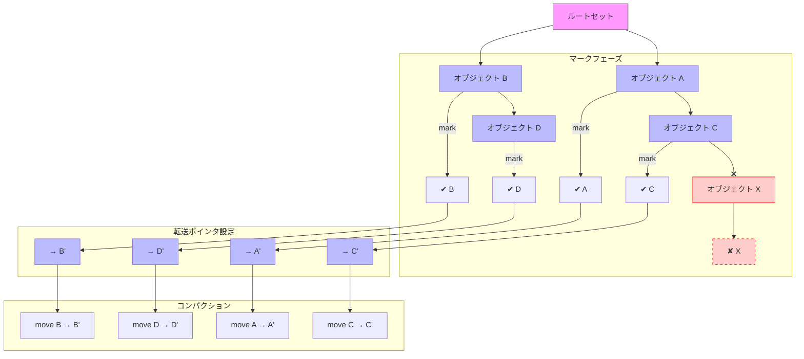

# ランタイムにおけるガベージコレクション

## 概要

このランタイムは、マーク・コンパクト方式のガベージコレクションを採用しています。特に、Lisp2アルゴリズムを用いており、メモリ管理の最適化を目指し、ガベージコレクションによるパフォーマンスオーバーヘッドを最小化しています。

### マーク・コンパクトアルゴリズム（Lisp2）
マーク・コンパクトGCは、主に2つのフェーズで動作します。

1. **マークフェーズ**：システムはルートセットからオブジェクトグラフをたどり、到達可能なオブジェクトをマークします。
2. **コンパクトフェーズ**：到達可能なオブジェクトがヒープの下端に移動され、フラグメンテーションされたメモリを回収します。このフェーズでは、オブジェクトへのポインタが新しい位置を反映するように更新され、転送ポインタがオブジェクトヘッダに書き込まれます。

この戦略は、各GCサイクル後にヒープを圧縮することでフラグメンテーションを避け、メモリの利用効率を向上させます。典型的なコピー方式のGCに見られるような「from-space」や「to-space」は使用しません。

## GCのトリガーとメモリ管理

- GCはシステムがメモリ回収を必要とする場合にトリガーされます。これには、高いメモリ使用量や、利用可能なヒープスペースを超えるメモリ割り当て要求などが含まれます。
- オブジェクトは`GcRef`で追跡され、そのポインタはGCによって管理されます。無効化されたオブジェクト、すなわちルートセットから到達不可能なオブジェクトは、マークフェーズ中に収集されます。

## 外部参照の取り扱い

コンパクトフェーズ中に、外部参照（例えばネイティブリソースへの参照）が到達不可能と判断されると、GCはそのオブジェクトのファイナライザロジックを実行し、メモリ回収前にクリーンアップを行います。これにより、ファイルハンドル、ネットワークソケット、その他の外部リソースが適切に解放され、リソースリークを防ぎます。

### ファイナライザロジック
ファイナライザはオブジェクトがガベージコレクションされる際にのみ実行されます。このタイミングでリソースが解放されることを保証し、安全な方法で解放処理を行います。

## ヒープおよびポインタ管理

ヒープはすべてのヒープ領域で管理されるオブジェクトが格納されるメモリ領域です。メモリ構造は以下の通りです：

- **ヒープオブジェクト**：これらはGCで管理されるオブジェクトで、`GcRef`ポインタで参照されます。
- **ポインタの無効化**：GC中、ヒープオブジェクトのポインタは以下の2つの主要なケースで無効化されます：
  1. **GCイベント**：GCがトリガーされた際に、オブジェクトが移動するため、ポインタが変更されます。
  2. **ヒープ拡張**：ヒープが現在の割り当てを超えて拡張される場合、ポインタが無効化され、更新が必要になります。

## GCとオブジェクトライフサイクル

### オブジェクトの割り当てと解放
オブジェクトはヒープに割り当てられ、そのライフサイクルはGCによって管理されます。オブジェクトが到達不可能となると、それらは収集対象としてマークされ、GCによって回収されます。

### オブジェクトの到達可能性
オブジェクトは、ライブオブジェクトから直接または間接的に参照されている場合に到達可能と見なされます。GCは、到達不可能なオブジェクトのみを収集します。

## メモリ安全性とエラー

- **ヒープ破損**：ランタイムは、オブジェクトのポインタが参照される前にその有効性を検証することにより、メモリ安全性を保証します。無効なポインタ（解放されたオブジェクトや存在しないオブジェクトを指すポインタ）はランタイムエラーを引き起こします。
- **無効なメモリアクセス**：オブジェクトのポインタが無効化されると、ポインタの更新が行われない限りアクセスできなくなります。これによりクラッシュや未定義の動作が発生するリスクがあります。

## まとめ

マーク・コンパクトガベージコレクタは、オブジェクトをマークし、ヒープを圧縮することによって効率的なメモリ管理を行います。転送ポインタとファイナライザロジックを活用することで、メモリ回収と外部参照の処理が安全に行われます。設計は、フラグメンテーションを最小化し、メモリ使用の最適化を目指しています。

---


```mermaid
graph LR
    subgraph Before_Compaction
        A1[オブジェクト A]
        B1[オブジェクト B]
        C1[オブジェクト C]
        D1[オブジェクト D]
        X1[オブジェクト X (死ぬ)]
        direction TB
        A1 --> B1 --> C1 --> D1 --> X1
    end

    subgraph After_Compaction
        A2[オブジェクト A (移動)]
        B2[オブジェクト B (移動)]
        C2[オブジェクト C (移動)]
        D2[オブジェクト D (移動)]
        direction TB
        A2 --> B2 --> C2 --> D2
    end

    Before_Compaction -->|コンパクション| After_Compaction

    %% Xが再利用されてA2が移動してくる
    X1 -.-> A2
    X1 -.->|空いているスペース| A2
    style A1 fill:#bbf
    style B1 fill:#bbf
    style C1 fill:#bbf
    style D1 fill:#bbf
    style X1 fill:#fcc,stroke:#f00
    style A2 fill:#bbf,stroke:#33f
    style B2 fill:#bbf,stroke:#33f
    style C2 fill:#bbf,stroke:#33f
    style D2 fill:#bbf,stroke:#33f
```
