# Relation-Driven Component Runtime

このドキュメントは `crates/telomere/src/component` の実装を、relation 駆動の観点から図で説明する。

前提は次のとおり。

- component バイナリは `ComponentEngine::compile` で一度だけ decode / validate する。
- `compile` の出力は `ComponentProgram` で、runtime はここに入っている relation snapshot を正本として解決する。
- runtime は JIT やバイナリ再走査をしない。
- 実行境界は local async で、`Store` は caller task 上で await される。

## 1. 全体像

relation 駆動とは、component バイナリをその場で何度も読んだり、文字列名から場当たり的に解決したりせず、`compile` 時に作った relation graph を実行時の唯一の解決経路にする設計である。

```mermaid
flowchart LR
    A["component binary"] --> B["decoder\nparse_component"]
    B --> C["validator\n型検証 / canonical option 検証"]
    C --> D["ComponentProgram\nroot + types + type_infos + relation stores"]
    D --> E["instantiate\nRuntimeEnv / RuntimeComponentInstance"]
    E --> F["call(name, args)"]
    F --> G["resolve_* by GlobalIdx"]
    G --> H["canon lift/lower\nstring / own / borrow / scalar"]
    H --> I["core wasm runtime\nrun_module_function / instantiate"]
```

この構成で重要なのは、`instantiate` と `call` が `bytes` を見ないことだ。必要なものはすべて `ComponentProgram` に入っている。

## 2. Compile 時に何を固定するか

`ComponentEngine::compile` は decoder と validator を通し、`ParseState` と `Validator` が集めた情報を `ComponentProgram` に固める。

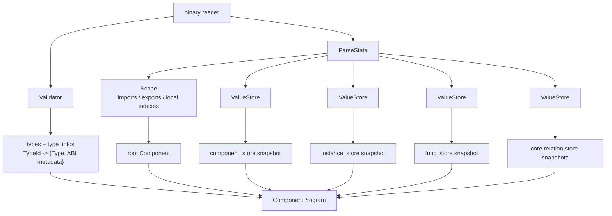

ここでの要点は `LocalIdx` と `GlobalIdx` の分離である。

- decoder は section 内の局所 index を読む。
- `ParseState` はそれを `GlobalIdx<T>` に正規化する。
- relation store には `GlobalIdx<T>` を key として保存する。
- runtime は `GlobalIdx<T>` を辿るだけでよい。

これにより nested component や alias が入っても、runtime は「いま見ている scope の何番目か」を覚える必要がない。

## 3. ComponentProgram の relation snapshot

現在の `ComponentProgram` は、単なる `bytes` のラッパーではない。root component と dense type table に加えて、kind ごとの relation store snapshot を持つ。

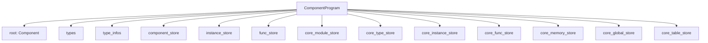

relation の形は大きく 2 種類ある。

### 3.1 component 側の relation

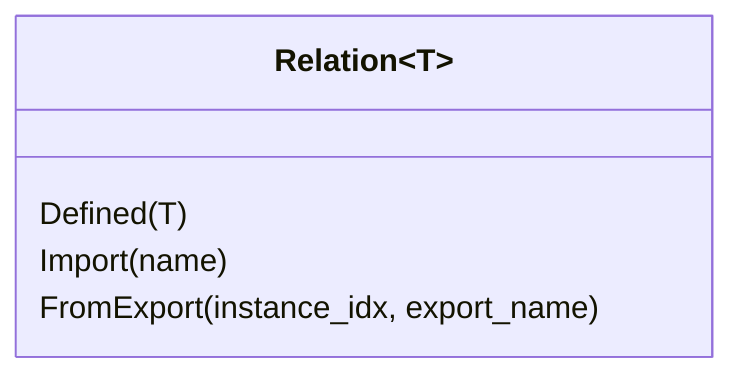

用途は次のとおり。

- `Defined(T)`
  - component / instance / func の定義本体を持つ。
- `Import(name)`
  - linker または親 environment から解決する。
- `FromExport(instance_idx, export_name)`
  - ほかの instance export を経由して解決する。

### 3.2 core 側の relation

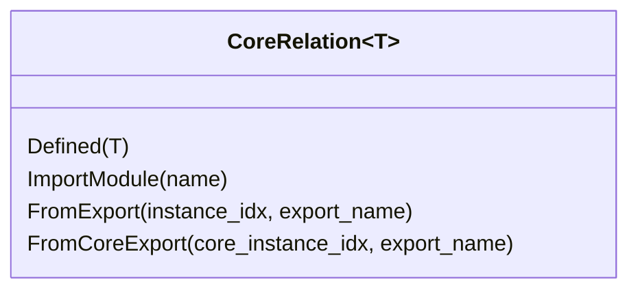

component 側より 1 段多いのは、core instance の export を直接 alias する経路が必要だからだ。`memory` や `table`、`canon lower/lift` で参照する core func もここから解決する。

## 4. Runtime が relation をどう辿るか

`instantiate` 後の runtime は `RuntimeEnv` と `RuntimeComponentInstance` を中心に動く。

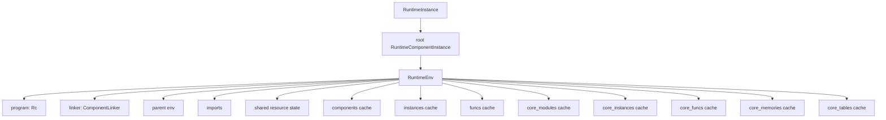

`call(name, args)` の中では export 名を 1 回だけ引き、以降は relation 解決に落ちる。

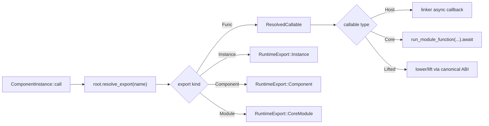

### 4.1 resolve 系の責務

runtime は kind ごとに `resolve_*` を持つ。

- `resolve_component`
- `resolve_instance`
- `resolve_func`
- `resolve_core_module`
- `resolve_core_instance`
- `resolve_core_func`
- `resolve_core_memory`
- `resolve_core_table`

これらはすべて同じ原則で動く。

1. cache を引く。
2. `ComponentProgram` の relation store を引く。
3. `Defined` ならその場で materialize する。
4. `Import` 系なら `imports` / `parent` / `linker` を引く。
5. `FromExport` 系なら参照先 instance を再帰解決して export を引く。
6. 結果を cache へ戻す。

この構造により、nested component、inline instance export、`instantiate (with ...)`、alias が同じ仕組みで処理される。

## 5. canonical ABI の実行パス

component 関数と core wasm 関数の境界では、`canon lower` と `canon lift` が値変換を行う。

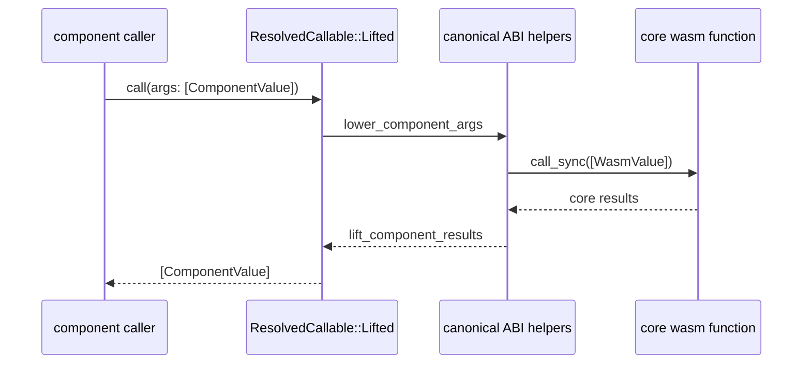

逆向き、つまり component import を core 側へ見せる経路では `canon lower` を host binding として core runtime に登録する。

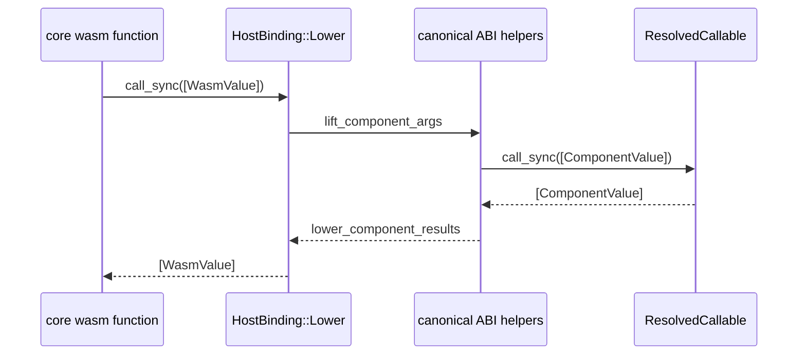

現在 runtime で実際に通している canonical ABI は次の範囲である。

- scalar
- `string`
- `list`
- `record`
- `tuple`
- `variant`
- `enum`
- `flags`
- `option`
- `result`
- `own` / `borrow`

flat 値数が `MAX_FLAT_PARAMS` / `MAX_FLAT_RESULTS` を超える場合は、type metadata に基づいて indirect area を確保し、memory + realloc 経由で受け渡す。

追加した typed API はこの canonical ABI 実装の薄い上位層である。

- `ComponentInstance::get_func`
- `ComponentInstance::get_typed_func`
- `TypedComponentFunc::call`
- `ComponentLinker::register_import_typed_async`
- `ComponentLinker::register_import_typed`

対応する Rust 型は軽量な built-in だけに絞っている。

- scalar / `bool` / `char`
- `String` / `&str`
- `Vec<T>`
- tuple `0..=8`
- `Option<T>`
- `Result<T, E>`

## 6. string と resource はなぜ別扱いか

embedded Linux 向け runtime では、string と resource handle が最も実運用に効くため、ここを優先して実装している。

### 6.1 string と複合値

string は `CanonicalOptions` に入っている次の情報に依存する。

- `string_encoding`
- `memory`
- `realloc`

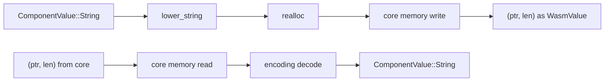

重要なのは、string と indirect passing を使う複合値が `memory` と `realloc` を必須にする点だ。component 関数の型だけでは完結せず、canonical option が揃って初めて lift/lower できる。

`list` / `record` / `tuple` / `variant` / `enum` / `flags` / `option` / `result` は compile 時に `type_infos` に flatten 長、indirect size、alignment、fixed-length list 長を落としておき、runtime では再計算しない。

### 6.2 resource

resource は instance 単位ではなく、runtime 全体の shared state に table を持つ。これは nested instance 間で destructor dispatch を安全に扱うためである。

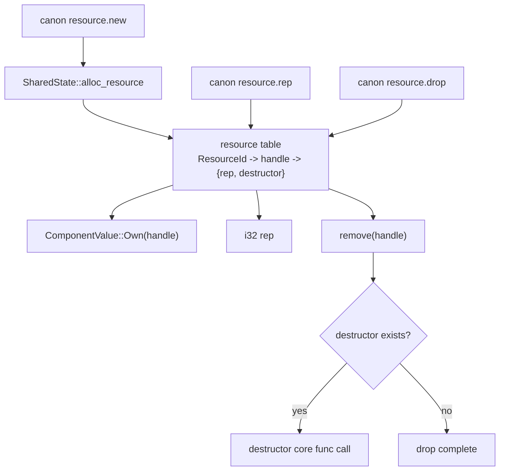

resource を relation 駆動で扱う利点は、destructor 自体も `CoreFunc` relation として同じ解決系に乗ることだ。resource だけ別の実行機構を生やしていない。

## 7. linker はどこで効くか

`ComponentLinker` は runtime の外側にある唯一の動的入力で、relation graph に欠けている import/export 実体だけを供給する。

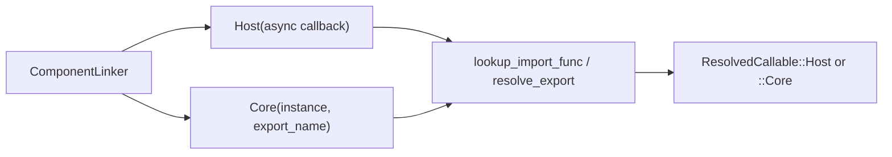

ここでの設計意図は次のとおり。

- relation graph は静的構造だけを持つ。
- host 実装の有無は linker で差し替える。
- core 側へ直結する場合も `instance + export_name` だけを持ち、追加の中間表現を増やさない。

`Store` は `Send` にしていないため、linker callback も caller task 上で await される local async 前提である。

## 8. embedded Linux 向けにこの形を選ぶ理由

relation 駆動の実利は、仕様上きれいだからではなく、軽量 runtime に必要なコスト管理がしやすいからだ。

### 8.1 削っているもの

- JIT / AOT
- runtime 時のバイナリ再 decode
- runtime 時の scope 再構築
- export 名 fallback による曖昧解決
- task spawn 前提の async 実行

### 8.2 残しているもの

- compile 時の validator による型検証
- relation store snapshot
- kind ごとの runtime cache
- sync dynamic values を通す canonical ABI
- typed function layer
- core wasm runtime の既存実装再利用

### 8.3 実装上のトレードオフ

現在の relation store と runtime cache は `HashMap<GlobalIdx<T>, ...>` を使っている。これは decode 時に index 空間を安全に固定しやすく、alias や nested component を実装するうえで単純だからである。

一方で、将来さらにメモリ密度を上げるなら、`GlobalIdx` の採番規則を固定したうえで dense table へ圧縮する余地がある。現状ドキュメントの対象はそこではなく、いま実装されている relation 駆動の実行モデルである。

## 9. 現在の境界

この runtime は「component model 全部入り」を目指していない。現時点の境界は次のとおり。

| 項目 | 状態 |
| --- | --- |
| binary decoder | 実装済み |
| relation 駆動 instantiate / call | 実装済み |
| nested component / inline instance / alias / `instantiate (with ...)` | 実装済み |
| `canon lift` / `canon lower` for scalar | 実装済み |
| `canon lift` / `canon lower` for `string` | 実装済み |
| `canon lift` / `canon lower` for `list` / `record` / `tuple` / `variant` / `enum` / `flags` / `option` / `result` | 実装済み |
| fixed-length list | 実装済み |
| nested names | 実装済み |
| typed funcs (`get_func` / `get_typed_func`) | 実装済み |
| `canon resource.new/drop/rep` | 実装済み |
| async canonical ABI / post-return | 非対象 |
| `CM_VALUES` / `CM_MAP` / `CM_GC` | 非対象 |
| `memory64` / `tags` | 非対象 |
| `wasmtime/*` 固有拡張 | 非対象 |

そのため、relation 駆動という言葉は「Wasmtime の同期 API 境界に必要な機能を relation snapshot で駆動している」という意味で使っている。async proposal 群や post-return まで含めた完全互換を意味しない。

## 10. 読む順番

コードを追うときは次の順で見ると速い。

1. `crates/telomere/src/component/engine.rs`
2. `crates/telomere/src/component/program.rs`
3. `crates/telomere/src/component/decoder/validator/state.rs`
4. `crates/telomere/src/component/ir/relation.rs`
5. `crates/telomere/src/component/runtime/mod.rs`
6. `crates/telomere/src/component/linker.rs`
7. `crates/telomere/src/component/func.rs`

これで `compile -> snapshot -> instantiate -> resolve -> canon -> core runtime` の流れを一通り追える。
