# Current Core Optimizer

このドキュメントは、現行 core optimizer を「現コードベースで何をやっているか」という観点で説明する as-built spec である。現在の正本実装、守っている制約、非目標、検証方法、出典をまとめる。

前提は次のとおり。

- 対象は core Wasm 実行系であり、component model optimizer の説明ではない。
- 最重要制約は direct-threaded runtime の `call_next` / `call_code` 契約を壊さないこと。
- `op_call` / `op_return_call` / indirect call の handler identity は維持する。
- 最適化は runtime 実行中に自己書換えしない。quickening は load-time only である。
- `RecordEmit` は debug/test の flatten 用に残るが、runtime 正本は packed operand stream である。

## 1. 全体像

現 optimizer は、「decode した `Instr` をそのまま小手先に fuse する pass」ではない。現在の流れは、parser-stage で residual IR を作り、そこで provenance を保ったまま rewrite/LICM を行い、最後に consumer-driven relower が `PackedOp` を選ぶ構成である。

```mermaid
flowchart LR
    A["decoded Instr + meta"] --> B["build_program"]
    B --> C["BasicBlockProgram"]
    C --> D["rewrite_program"]
    D --> E["ValueGraph + BlockBody + BlockArgument"]
    E --> F["apply_licm"]
    F --> G["effect-result spill planning"]
    G --> H["relower_block_body"]
    H --> I["PackedOp list"]
    I --> J["build_packed_stream"]
    J --> K["PackedOpStream"]
    K --> L["flatten to Instr + op_lens"]
    L --> M["instantiate-time direct-call predecode"]
    M --> N["runtime direct-threaded execution"]
```

正本関数は以下である。

- optimizer 入口: [`optimize_function`](../../crates/telomere/src/parser/core/optimizer/pass.rs)
- residual IR 構築: [`rewrite_program`](../../crates/telomere/src/parser/core/optimizer/pass.rs)
- consumer-driven relower: [`relower_block_body`](../../crates/telomere/src/parser/core/optimizer/pass.rs)
- packed canonicalization: [`build_packed_stream`](../../crates/telomere/src/parser/core/optimizer/sink.rs)
- call recipe predecode: [`predecode_direct_call_operands`](../../crates/telomere/src/runtime/instantiate.rs)
- direct call dispatch: [`op_call`](../../crates/telomere/src/runtime/vm/call.rs), [`op_return_call`](../../crates/telomere/src/runtime/vm/call.rs)

## 2. 守っている制約

この optimizer が守る hard constraints は、現コードでは次のように保っている。

- tail-call threading は維持する。
  - runtime の dispatch 入口は依然として [`runtime/vm.rs`](../../crates/telomere/src/runtime/vm.rs) の direct-threaded 実装であり、optimizer は handler identity を変えない。
- `call/control/trap-sensitive/table` は explicit に残す。
  - optimizer は pure 値と effect 値を分けて扱い、trap-sensitive 数値 op や `call` は verifier と barrier で保護する。
- runtime-growing side table は入れない。
  - `CallRecipe`、`ConstPool`、`PackedOpStream`、`BlockCopyPlan` はすべて function-size proportional な load-time metadata に閉じる。
- JIT/tier-up は scope 外に保つ。
  - WAMR を参考にしているのは fast interpreter の load-time rewrite であり、execution engine 自体は置換していない。

## 3. 現在の正本 IR

### 3.1 Residual IR

optimizer の正本 IR は [`expr.rs`](../../crates/telomere/src/parser/core/optimizer/expr.rs) と [`pass.rs`](../../crates/telomere/src/parser/core/optimizer/pass.rs) にある。

- `ValueGraph`
  - pure value と effect result の provenance を保持する。
- `BlockBody`
  - raw emit 列ではなく、後段の consumer-driven relower が読む residual body。
- `BlockArgument`
  - merge の正本。slot 化しても消さない。
- `SlotShape`
  - `slot`, `address`, `loop_value` を lossless に持つ。
- `ProviderClass`
  - `LocalLoad`, `Const`, `PureUnary`, `PureBinary`, `EffectResultSpill` を区別する。
- `MaterializationCost`
  - `Immediate`, `Local`, `Pure`, `Spill` を持ち、rematerialization の aggressiveness を制御する。

### 3.2 Slot モデル

slot 正本化は [`SlotRef`](../../crates/telomere/src/parser/core/optimizer/expr.rs) と [`BlockCopyPlan`](../../crates/telomere/src/parser/core/optimizer/pass.rs) を中心に実装している。

- `SlotClass`
  - `EntryLocal`
  - `TempLocal`
  - `SpillLocal`
  - `VirtualStack`
  - `ConstPoolRef`
- `BlockCopyPlan`
  - merge で slot-preserving にできるか、copy を入れるべきかを block ごとに固定する。
- `EffectResultSpillPlan`
  - effect result を explicit spill local に割り当て、relower で再利用できるようにする。

重要なのは、「slot は `BlockArgument` の代替ではなく lowering 先」であることだ。join はあくまで block argument 正本で行い、slot-preserving できるときだけ local-like な lowering に落とす。

## 4. Packed Operand 正本

Phase 1 の中心は [`PackedOpStream`](../../crates/telomere/src/parser/core/optimizer/sink.rs) である。runtime が読む operand はここで fixed-shape 化される。

- `PackedOperand::I32/I64/F32/F64/U32`
- `PackedOperand::ConstPoolRef`
- `PackedOperand::CallRecipeRef`
- `PackedOperand::LocalAddr`
- `PackedOperand::SelectWidth`
- `PackedOperand::JumpTarget`
- `PackedOperand::MemArg`
- `PackedOperand::BlockReturn`
- `PackedOperand::LoopParam`

現在の packed canonicalization は次を行う。

- `i32.const` / `i64.const` の function-local const pool 化
  - policy は `reused >= 2`
- branch target ordinal の前計算
- `memarg` の packed 化
- typed `select4/8/16` の width 正本化
- direct call operand の `CallRecipeRef` 化
- specialized memory family の `LocalAddr + immediate + MemArg` 正本化

packed stream の verifier は [`verify_packed_stream`](../../crates/telomere/src/parser/core/optimizer/sink.rs) にあり、jump target、const pool ref、call recipe ref、specialized fused operand の形崩れを reject する。

## 5. Call/Frame の predecode

Phase 5 の call path は [`CallRecipeRef`](../../crates/telomere/src/common.rs) と [`CallRecipe`](../../crates/telomere/src/common/store.rs) に寄せている。

- instantiate 時に [`predecode_direct_call_operands`](../../crates/telomere/src/runtime/instantiate.rs) が direct call operand を recipe slot 付き `CallRecipeRef` に変換する。
- store は [`build_call_recipe`](../../crates/telomere/src/common/store.rs) で `param_size`, `local_size`, `return_arity`, `frame`, `target` を構築する。
- runtime は [`decode_direct_call_recipe`](../../crates/telomere/src/runtime/vm/call.rs) で recipe slot を 1 回読むだけで callee を復元する。

これにより、direct call hot path は repeated lookup を避けつつ、`op_call` / `op_return_call` の handler identity は保っている。
import split (`op_call_import` / `op_return_call_import`) はこの ABI を共有したまま relower 対象に含める。indirect call path は handler と packed operand ABI を分離したまま、materializer canonicalization だけを relower が担当する。

## 6. Consumer-Driven Relower

現在の relower は、旧来の「selector pass が `BlockBody` を書き換えてから flatten する」構成ではない。`relower_block_body` が residual body を逆順に見ながら、consumer が必要とする provider を吸収して `PackedOp` を出す。

### 6.1 Local/Control family

ローカル系の specialization は [`pass.rs`](../../crates/telomere/src/parser/core/optimizer/pass.rs) の consumer-driven builder 群で行う。

- direct `local.get4 + br_if`
- `i32.eqz + br_if`
- retained legacy `local_get4 + i32.const + add + tee + br_if`
- generic `op_local_binop32*`
  - `i32`: `add/sub/mul/and/or/xor/shl/shr_s/shr_u/rotl/rotr`
  - `f32`: `add/sub/mul/div`
- generic `op_local_binop64*`
  - `i64`: `add/sub/mul/and/or/xor/shl/shr_s/shr_u/rotl/rotr`
  - `f64`: `add/sub/mul/div`
- generic `op_local_unary32*`
  - `i32`: `clz/ctz/popcnt`
  - `f32`: `abs/neg/sqrt/ceil/floor/trunc/nearest`
- generic `op_local_unary64*`
  - `i64`: `clz/ctz/popcnt`
  - `f64`: `abs/neg/sqrt/ceil/floor/trunc/nearest`
- generic `op_local_cmp32*`
  - `i32`: `eq/ne/lt/le/gt/ge`
  - `f32`: `eq/ne/lt/le/gt/ge`
- generic `op_local_cmp64*`
  - `i64`: `eq/ne/lt/le/gt/ge`
  - `f64`: `eq/ne/lt/le/gt/ge`

### 6.2 Call/Select family

`select` は typed `op_select4/8/16` までを扱い、call path は handler identity を変えない。

- direct / import direct / indirect call (`op_call` / `op_return_call` / `op_call_import` / `op_return_call_import` / `op_call_indirect` / `op_return_call_indirect`) は consumer-driven relower の対象に入っている
- ただし call 自体を新 opcode family に置き換えるのではなく、call consumer 側で materializer 列だけを正本化する
- direct call operand は引き続き `CallRecipeRef`
- indirect call operand は引き続き `U32(tableidx), U32(typeidx)` のまま保つ
- 正本化対象は 2 系統ある。movable tree は local/scalar const leaf、`local.tee` の stable slot alias、`op_ref_null` / `op_ref_func` / `v128.const` の zero-input leaf、そこからなる non-trapping unary/binop/cmp tree、`i32.eqz` / `i64.eqz`、それらだけで構成された scalar `select` tree。anchored tree は nested `op_call*`、numeric trap-sensitive op (`i32/i64 div/rem`, `i32/i64 trunc_*`)、`global.get4/8/16`、`table.get`、それらを child に含む scalar `select` と contiguous `memory.load` leaf
- partial apply は supported trailing suffix に限定する。unsupported prefix が 1 つでも出たら、その左側は generic materialization のまま残す。indirect call では table index もこの suffix 判定に含める
- pure で non-anchored な tree については、provider elimination が `multi-use`、`needs_spill`、same-block の memory-address shared で止まる場合でも、call 直前で materializer 列だけを replay して specialized suffix に含められる
- anchored tree や mixed site の hole で strict contiguous trailing suffix を満たせない場合は、CFG-aware な temp-local windowing を行う。same-block straight-line な rooted tree は producer 直後で synthetic `local.set temp` に退避し、call 直前で synthetic `local.get temp` を差し込む。cross-block な merge-fed value や successor block argument は、列挙可能な predecessor edge それぞれで temp write を差し込み、call block 側では同じ temp local を読む形へ寄せる。`store` root や control boundary 自体は replay しないが、boundary の前後で temp local を介して suffix 化できる
- `memory.load` leaf は、address subtree も含めて contiguous trailing suffix に完全に収まり、address 側が safe scalar tree か anchored child を含む safe scalar tree に落ちる場合だけ許可する
- temp-local windowing も call relower 本体の任意位置 partial apply ではなく、call 前の window を suffix へ正規化するだけに留める。same-function 内で call region に入る全 predecessor edge を列挙して temp write を置ける範囲までは block/control 境界を跨いで temp local 化し、irreducible な predecessor graph でもこの条件を満たす限り対象に入れる。handler 差し替えや cross-function rewrite は行わない
- 依然として対象外なのは inner `return_call*` result を standalone leaf として扱うこと、cross-function consumer、incoming edge を全列挙できない CFG 領域、型不一致の edge merge である

provider elimination の条件は保守的に固定している。これに引っかかった pure tree は provider を消さず replay-only で扱うことがある。

- single-use
- barrier 非跨ぎ
- hoisted value ではない
- effect result 直値ではない
- memory address producer と共有しない

### 6.2 Memory family

memory は `AddressShape` を候補抽出に使いつつ、最終判定は `SlotRef` で行う。adjacent provider pattern だけでなく、block argument / LICM / merge 後に residual graph 側へ残った `AddressShape` からでも、既存 `*_local_base` / `*_indexed_local_base` へ正規化できる場合は specialized path を選ぶ。

- `local/spill + load`
- `local/spill + const + add/sub + load`
- `local/spill + store`
- `local/spill + const + add/sub + store`

address provider と value provider は独立に消去判定する。generic semantics を壊す可能性がある場合は常に generic path へフォールバックする。

### 6.3 Select / Compare-Control

typed `select4/8/16` と compare/control は Phase 6 として拡張している。

- `select4/8/16` は arm 両側が lossless `SlotShape` を持つ場合に provenance を引き継ぐ。
- `eqz/compare + br_if` は `LoopValueShape` と `SlotRef` の両方から成立判定できる。

### 6.4 Trap-sensitive barrier

trap-sensitive な純粋数値 op は「pure だから消せる」扱いにしない。`drop(i32.div_s ...)` のようなケースで trap を消さないため、explicit barrier へ落としている。これは Wasm の observable trap semantics を優先した実装である。

## 7. 実装ステップごとの対応

実装時の phase ラベルを、現コードに対応付けると次のとおり。

| Phase | 現在の実装 | 正本コード |
| --- | --- | --- |
| 0 | family 候補群、`top-k=16`、budget、logical layout order を固定 | [`runtime/vm.rs`](../../crates/telomere/src/runtime/vm.rs), [`optimizer-family-budgets.md`](./optimizer-family-budgets.md) |
| 1 | `PackedOpStream`、const pool、typed operand pack、branch target predecode | [`sink.rs`](../../crates/telomere/src/parser/core/optimizer/sink.rs) |
| 2 | `SlotRef`、`SlotShape`、`BlockCopyPlan`、effect spill slot | [`expr.rs`](../../crates/telomere/src/parser/core/optimizer/expr.rs), [`pass.rs`](../../crates/telomere/src/parser/core/optimizer/pass.rs) |
| 3 | local/control provider elimination を consumer-driven lowering へ移行 | [`pass.rs`](../../crates/telomere/src/parser/core/optimizer/pass.rs) |
| 4 | specialized memory family を slot-based に再構成 | [`pass.rs`](../../crates/telomere/src/parser/core/optimizer/pass.rs), [`sink.rs`](../../crates/telomere/src/parser/core/optimizer/sink.rs) |
| 5 | `CallRecipeRef` / `CallRecipe` による direct call predecode | [`common.rs`](../../crates/telomere/src/common.rs), [`common/store.rs`](../../crates/telomere/src/common/store.rs), [`runtime/instantiate.rs`](../../crates/telomere/src/runtime/instantiate.rs), [`runtime/vm/call.rs`](../../crates/telomere/src/runtime/vm/call.rs) |
| 6 | typed select と compare/control provider elimination を拡張 | [`pass.rs`](../../crates/telomere/src/parser/core/optimizer/pass.rs) |
| 7 | handler adjacency の計測、family-group 集計、logical layout order の固定 | [`runtime/vm.rs`](../../crates/telomere/src/runtime/vm.rs), [`optimizer-family-budgets.md`](./optimizer-family-budgets.md) |
| 8 | selector を独立 pass として持たず、`relower_block_body` に内包 | [`pass.rs`](../../crates/telomere/src/parser/core/optimizer/pass.rs), [`sink.rs`](../../crates/telomere/src/parser/core/optimizer/sink.rs) |

補足すると、Phase 8 の「`rewrite_program` の中で PackedOp 候補まで育てる」は、現コードでは `rewrite_program` が residual IR を構築し、`relower_block_body` がその IR から直接 `PackedOp` を選ぶ形で実現している。つまり selector は独立 pass ではないが、PackedOp selection 自体は relower 側にある。

## 8. Profiling と budget

Phase 0 と Phase 7 の運用は [`optimizer-family-budgets.md`](./optimizer-family-budgets.md) に固定している。

### 8.1 Optimizer-side profiling

optimizer 側は [`OptimizerProfiler`](../../crates/telomere/src/parser/core/optimizer/pass.rs) が担当する。

- hot block visit
- packed stream growth
- family group ごとの candidate count
- expected provider elimination 数

family group は次の 3 群で固定する。

- `local/control`
- `memory`
- `call/select`
  - call relower は `op_call` / `op_return_call` / `op_call_import` / `op_return_call_import` / `op_call_indirect` / `op_return_call_indirect` の identity を保ったまま、materializer 列だけを consumer 側で正本化する
  - 正本化対象は local/scalar const leaf、stable slot alias、`op_ref_null` / `op_ref_func` / `v128.const` の zero-input leaf、`i32.eqz` / `i64.eqz` を含む non-trapping unary/binop/cmp tree、nested `op_call*`、numeric trap-sensitive op (`i32/i64 div/rem`, `i32/i64 trunc_*`)、`global.get4/8/16`、`table.get`、それらを child に含む scalar `select`、contiguous trailing suffix に閉じた `memory.load` leaf、replay-only pure tree、そして CFG-aware temp-local windowing で suffix 化した anchored / merge-fed / mixed site。partial apply 自体は trailing suffix 限定のままで、indirect call の table index もこの判定に含める
  - temp-local windowing は same-block だけでなく、call region に入る全 predecessor edge を列挙できる CFG まで広げている。`if` / `br_if` / `special_block_return` を経た merge result や successor block argument は predecessor 側で temp write し、call block では synthetic `local.get temp` を読む。same-block の `store` / control boundary を跨ぐ rooted tree も同じ temp-local buffering で suffix 化する
  - `return_call*` 自体は terminator のまま保持し、値 producer には再分類しない。対象に入るのは `return_call*` を含む predecessor edge が供給する merge 結果や successor block argument までである

### 8.2 Runtime-side profiling

runtime 側は `vm-profile` feature 配下の [`DispatchProfileRunGuard`](../../crates/telomere/src/runtime/vm.rs) が担当する。

- top op
- top pair
- top triple
- `layout_span`
- family group ごとの集計

通常 build では profiling を完全 no-op にし、bench / production binary の hot path を汚さない。profile build だけが環境変数で集計を有効化する。

## 9. 何を intentionally やっていないか

以下は現 optimizer の non-goal であり、現コードも意図的に採用していない。

- runtime 中の adaptive quickening
- self-modifying opcode rewrite
- speculative deopt / OSR
- runtime-growing inline cache
- handler replication
- JIT / AOT / tier-up への engine 置換
- interprocedural summary
- memory/table の aggressive LICM beyond current proofs

この optimizer は「あくまで parser-stage optimizer + load-time predecode + runtime operand layout の改善」であって、新しい execution engine ではない。

## 10. 固定 gate と運用

現 optimizer を変更するときの固定 gate は次を使う。

- `cargo fmt --all -- --check`
- `cargo clippy --workspace --all-targets --tests -- -D warnings`
- `cargo test -p telomere parser::core::optimizer -- --test-threads=1`
- `cargo test --bin telomere-cli core_wasi_preview1 -- --test-threads=1`
- `cargo test -p telomere --release release_call_loop_keeps_direct_threading -- --exact`
- `cargo test -p telomere --release release_memory_loop_keeps_tail_call_threading -- --exact`
- `cargo test -p telomere --release`
- `cargo bench -p telomere --bench telomere_bench fib -- --sample-size 10 --measurement-time 1`
- `cargo run --release -- /Users/sizumita/Workspace/misc/coremark/coremark.wasm`

回帰の見方は次の優先度で固定する。

1. semantics regression を止める
2. tail-threading / preview1 を壊さない
3. `fib` 非劣化
4. CoreMark 改善
5. profiler 上の generic path 比率低下

## 11. 出典と採用点

この optimizer は単一文献の写経ではなく、複数の系統を明示的に統合している。以下が現在の source basis である。

### 11.1 Abstract interpretation / SSA 系

- [POPL23] `SSA Translation Is an Abstract Interpretation`
  - `BlockArgument` 正本の merge、lossless provenance、SSA-like local/stack propagation の基礎。
- [PLDI24] `Compiling with Abstract Interpretation`
  - residual CFG を解析結果と一体で育てる考え方、pass 境界を薄くする方向、selector を relower に寄せる構成。

### 11.2 Quickening / inline caching 系

- [POPL84] `Efficient Implementation of the Smalltalk-80 System`
  - inline cache と common-case optimization の原点。現コードでは runtime-growing cache は採用せず、load-time `CallRecipe` に制約している。
- [DLS10] `Efficient interpretation using quickening`
  - load-time only quickening の設計根拠。現コードでは self-modifying runtime quickening をやらず、packed stream への一方向 rewrite だけ採用する。
- [ECOOP10] `Inline Caching Meets Quickening`
  - direct call operand を `CallRecipeRef` に置く設計根拠。polymorphic cache line は作らず、recipe slot に限定している。

### 11.3 Stack-vs-register / superinstruction 系

- [TACO08] `Virtual machine showdown: Stack versus registers`
  - stack producer を slot 正本へ変換し、executed VM op 数を減らす方向の根拠。
- [SCOPES03] `Towards Superinstructions for Java Interpreters`
  - family を consumer 側から選び、dispatch 削減を structural rule に落とす考え方。
- [IMT10] `How to Select Superinstructions for Ruby`
  - top trace 駆動で family を採用し、hot path に出ない family を増やさない運用。

### 11.4 Threaded interpreter / layout 系

- [JILP03] `The Structure and Performance of Efficient Interpreters`
  - threaded interpreter を前提に最適化を積む方針。`call_next` / `call_code` を不変に保つ根拠。
- [TOPLAS07] `Optimizing Indirect Branch Prediction Accuracy in Virtual Machine Interpreters`
  - family 爆発と adjacency を budget 管理する根拠。現コードでは `layout_span` と logical group order に落としている。
- [CC11] `Interpreter Instruction Scheduling`
  - handler layout を最後の phase に回し、family 集合が安定してから adjacency を調整する順序づけの根拠。

### 11.5 WAMR Fast Interpreter 系

- [WAMR-README]
  - fast interpreter と classic interpreter の差、small footprint と internal opcode rewrite の位置づけ。
- [WAMR-FI]
  - fast interpreter が Wasm opcode を internal opcode へ前処理する設計と、load-time rewrite の考え方。
- [WAMR-MODES]
  - runtime running mode を load-time / startup 時に固定する考え方。

この repo で WAMR から採っているのは fast interpreter の「load-time rewrite」と「fixed-shape internal operand」の思想だけであり、WAMR の execution engine をそのまま移植しているわけではない。

### 11.6 `microJIT` という語について

設計メモでは source basis の 1 つとして `microJIT` を挙げていたが、現コードで直接採用しているのは「expression-array 的な provider/consumer 管理」と「slot-oriented な lowering」という抽象側のアイデアである。文献上の位置づけとしては [TACO08], [SCOPES03], [JILP03], [DLS10] の組み合わせに近い。

したがって、この文書では `microJIT` を個別実装名として追うより、slot 化・provider 消去・quickening の 3 軸に分解して説明する。

## 12. References

- [POPL84] L. Peter Deutsch, Allan M. Schiffman, _Efficient Implementation of the Smalltalk-80 System_, POPL 1984. <https://dblp.org/rec/conf/popl/DeutschS84>
- [POPL23] Matthieu Lemerre, _SSA Translation Is an Abstract Interpretation_, Proc. ACM Program. Lang. 7(POPL), 2023. <https://dblp.org/rec/journals/pacmpl/Lemerre23>
- [PLDI24] Dorian Lesbre, Matthieu Lemerre, _Compiling with Abstract Interpretation_, Proc. ACM Program. Lang. 8(PLDI), 2024. <https://dblp.org/rec/journals/pacmpl/LesbreL24.html>
- [DLS10] Stefan Brunthaler, _Efficient interpretation using quickening_, DLS 2010. <https://dblp.org/rec/conf/dls/Brunthaler10>
- [ECOOP10] Stefan Brunthaler, _Inline Caching Meets Quickening_, ECOOP 2010. <https://dblp.org/rec/conf/ecoop/Brunthaler10>
- [CC11] Stefan Brunthaler, _Interpreter Instruction Scheduling_, CC 2011. <https://dblp.org/rec/conf/cc/Brunthaler11>
- [JILP03] M. Anton Ertl, David Gregg, _The Structure and Performance of Efficient Interpreters_, JILP 5, 2003. <https://dblp.org/rec/journals/jilp/ErtlG03>
- [SCOPES03] Kevin Casey, David Gregg, M. Anton Ertl, Andrew Nisbet, _Towards Superinstructions for Java Interpreters_, SCOPES 2003. <https://dblp.org/rec/conf/scopes/CaseyGEN03>
- [IMT10] Salikh Zakirov, Shigeru Chiba, Etsuya Shibayama, _How to Select Superinstructions for Ruby_, Information and Media Technologies 5, 2010. <https://dblp.org/rec/journals/imt/ZakirovCS10>
- [TACO08] Yunhe Shi, Kevin Casey, M. Anton Ertl, David Gregg, _Virtual machine showdown: Stack versus registers_, ACM TACO 4(4), 2008. <https://dblp.org/rec/journals/taco/ShiCEG08>
- [TOPLAS07] Kevin Casey, M. Anton Ertl, David Gregg, _Optimizing indirect branch prediction accuracy in virtual machine interpreters_, ACM TOPLAS 29(6), 2007. <https://dblp.org/rec/journals/toplas/CaseyEG07>
- [WAMR-README] _WebAssembly Micro Runtime (WAMR) README_. <https://github.com/bytecodealliance/wasm-micro-runtime>
- [WAMR-FI] _WAMR fast interpreter introduction_, WAMR Blog. <https://bytecodealliance.github.io/wamr.dev/blog/wamr-fast-interpreter-introduction/>
- [WAMR-MODES] Tianlong Liang, _Introduction to WAMR running modes_, WAMR Blog, 2023. <https://bytecodealliance.github.io/wamr.dev/blog/introduction-to-wamr-running-modes/>
